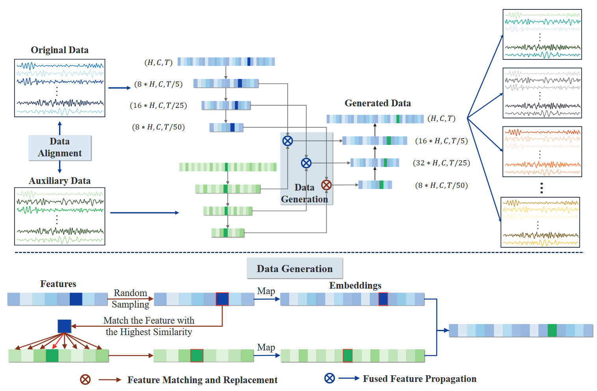

## FusionGen
## 📌 Abstract
Brain-computer interfaces (BCIs) provide potential for applications ranging from medical rehabilitation to cognitive state assessment by establishing direct communication pathways between the brain and external devices via electroencephalography (EEG). However, EEG-based BCIs are severely constrained by data scarcity and significant inter-subject variability, which hinder the generalization and applicability of EEG decoding models in practical settings. To address these challenges, we propose FusionGen, a novel EEG data generation framework based on disentangled representation learning and feature fusion. By integrating features across trials through a feature matching fusion module and combining them with a lightweight feature extraction and reconstruction pipeline, FusionGen ensures both data diversity and trainability under limited data constraints. Extensive experiments on multiple publicly available EEG datasets demonstrate that FusionGen significantly outperforms existing augmentation techniques, yielding notable improvements in classification accuracy.

## 🚀  Contributions
- 🧩 We propose FusionGen, a few-shot EEG data generation framework that enhances generalization and scalability in brain–computer interface applications.
- 🛠️ We introduce a feature matching fusion module that integrates cross-sample features in the latent representation space and reconstructs high-fidelity EEG signals from these fused embeddings. 
- 📊 We validate FusionGen on multiple EEG datasets on MI and SSVEP paradigms, showing consistent accuracy improvements in few-shot scenarios.
